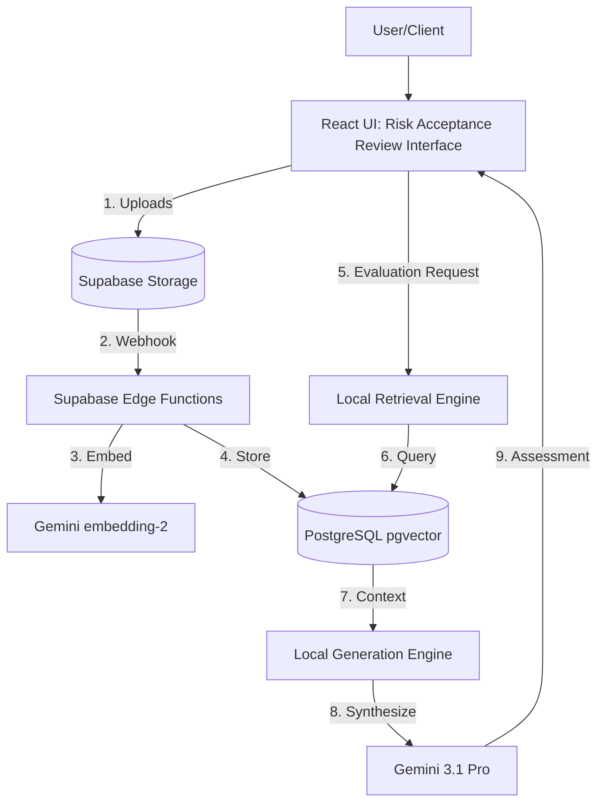
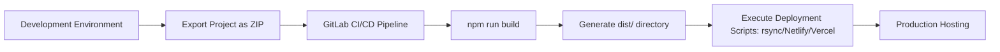
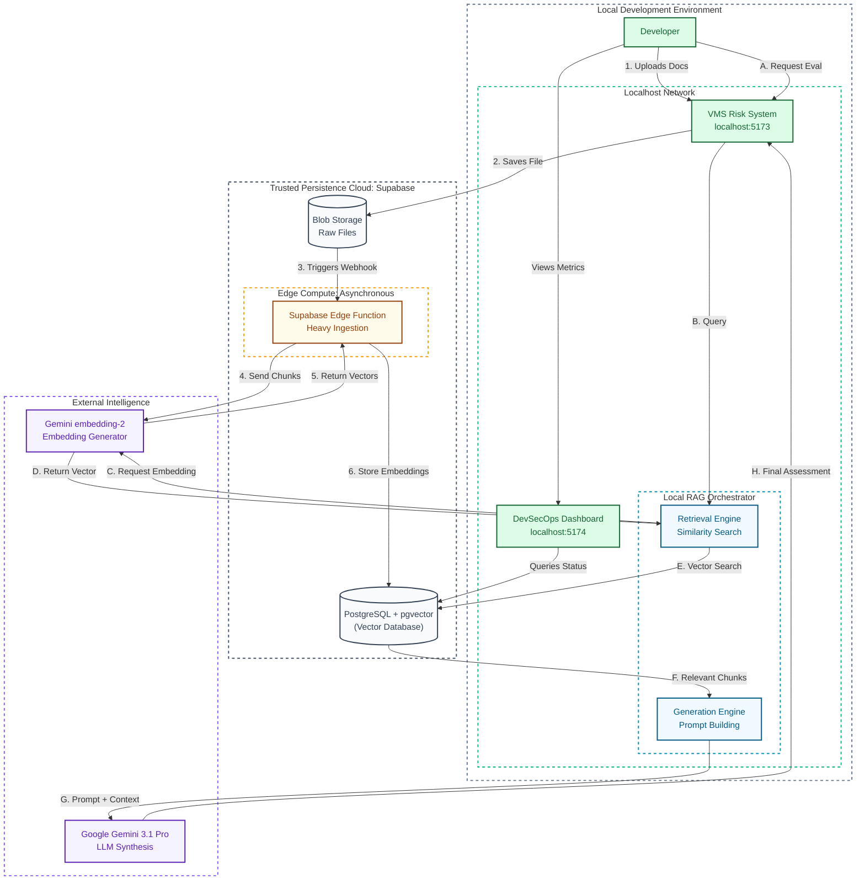
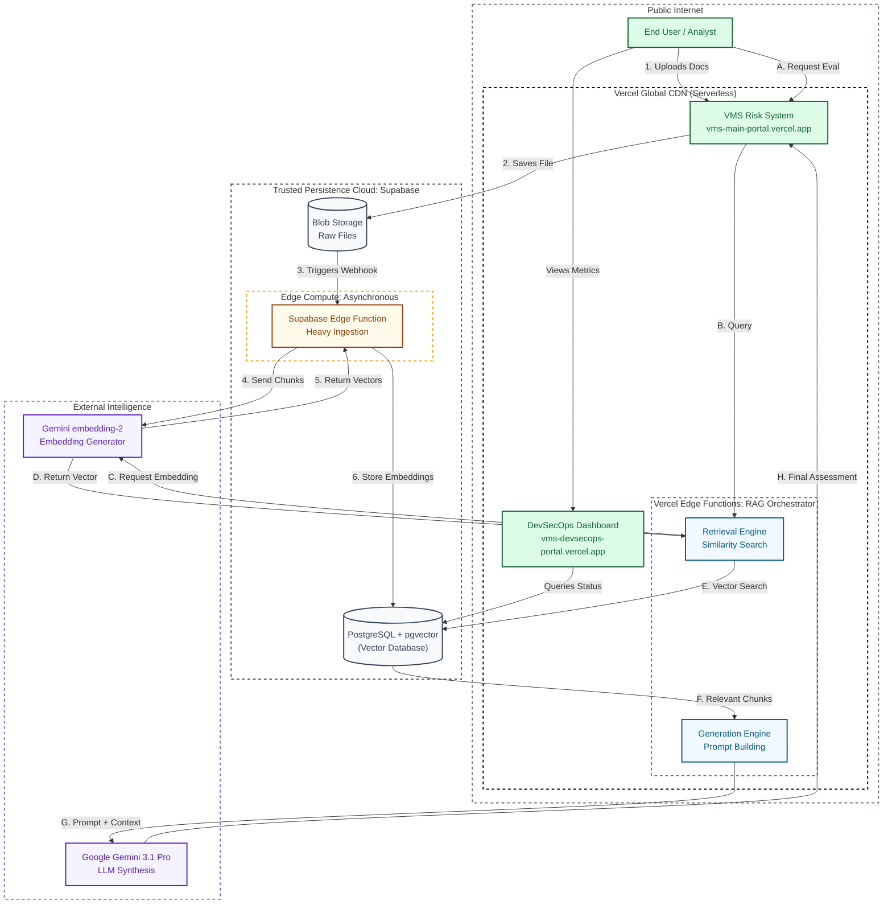

# Architecture Design Document (ADD): Vulnerability Management Interface (VMS)

## 1. Overview
The **Vulnerability Management Interface (VMS)** is an AI-powered cybersecurity risk assessment tool designed to help organizations evaluate risks based on MITRE ATT&CK and ATLAS frameworks.

## 2. Domain Knowledge & Operational Context

The architectural decisions and the specific prompt engineering for the RAG system are grounded in real-world operational artifacts (stored in `VMS/context/`). This ensures the AI assistant accurately emulates the manual risk assessment process it is designed to replace.

### Core Objectives
The primary goal of the VMS is to replace the manual, laborious, multi-endorsement ServiceNow workflow for vulnerability risk assessments. By automating the synthesis of vulnerability announcements, deployment context, and mitigating controls, the system aims to reduce assessment time by 50%.

### Operational Inputs
The system is designed to ingest and analyze diverse data sources:
- **Raw Scanner Data (CSVs):** Typical outputs from tools like Nessus, providing the baseline CVE, affected hosts, and unmitigated severity scores.
- **Vendor Correspondence (PDFs/Emails):** Real-world communications confirming vulnerability impact or, crucially, stating when no official patch or mitigation is available. This forces the system to rely on compensating controls.

### The Analytical Framework
The RAG generation engine is strictly instructed to follow the human analysis framework defined by the organization's security guidelines:
- **Risk Matrix:** A 5x5 grid calculating Risk based on Impact (Negligible to Very Severe) and Likelihood (Rare to Highly Likely).
- **Impact Rating:** Evaluated across Confidentiality, Integrity, and Availability (CIA). The *highest* individual rating among the three determines the overall Impact score.
- **Likelihood Rating:** Calculated as the average of three factors: `(Discoverability + Exploitability + Reproducibility) / 3`, rounded to the nearest integer.
- **Residual Risk:** The system must clearly delineate the "Current Risk" (baseline scanner data) and the "Residual Risk" (the recalculated score after applying identified mitigating actions like firewalls or network isolation).

## 3. Core Architecture
- **Frontend:** React 18+ with TypeScript, styled using Tailwind CSS and components from Radix UI and MUI.
- **Backend/Persistence:** Supabase (PostgreSQL + Storage) used for persistent data and document storage.
- **Analysis Engines:** A set of domain-specific synthesis engines (Architecture, Threat Modeling, Risk Evaluation) located in `src/lib/`.

## 4. Directory Mapping
- `/src/app/`: Primary UI components, orchestrating state and user interactions.
- `/src/lib/`: Business logic, analysis engines, and Supabase client integration.
- `/src/styles/`: Global stylesheets and theme definitions.
- `/supabase/`: Edge functions and database schemas.

## 6. Key Data Flow
The system operates on two distinct data loops: the **Asynchronous Ingestion Loop** (Steps 1-3) and the **Real-time Analytical Loop** (Steps 4-8).

1. **Input & Persistence:** Artifacts are uploaded via `FileUploadZone.tsx` to Supabase Storage.
2. **Edge Processing:** Storage webhooks trigger Edge Functions to extract text and request embeddings from `gemini-embedding-2`.
3. **Vector Storage:** Processed chunks and 768-dimensional vectors are persisted in `pgvector`.
4. **Contextual Retrieval:** Upon evaluation request, the VMS Retrieval Engine generates a query embedding and performs a similarity search.
5. **Evidence Injection:** Relevant document fragments are retrieved from the database as technical context.
6. **LLM Synthesis:** The base assessment and retrieved evidence are sent to `gemini-3.1-pro-preview`.
7. **Final Assessment:** The AI synthesizes a substantiated, cited report.
8. **Explainability (XAI):** Decisions are rendered with full technical transparency via `RiskAcceptanceReview.tsx`.

## 7. System Architecture Diagram

## 8. Deployment Pipeline (Rabbit Deploy)

## 9. DevSecOps and Lifecycle
To ensure elite-standard, secure delivery, the Elite Team follows this mandatory lifecycle:

1. **Plan & Audit:** Every change starts by referencing this Architecture ADD.
2. **Implement:** Development occurs in isolated branches. 
3. **Adversarial Test (QA):** Paranoid QA conducts negative, boundary, and regression testing.
4. **Security Audit:** Security Engineer verifies Supabase policies and data-handling practices.
5. **Configuration Review:** Meticulous Configuration Manager validates the state and triggers rollback procedures if necessary.
6. **Deploy & Document:** Upon success, the ADD and deployment documentation are updated to reflect the new state.

*Any deviation from this lifecycle without explicit team consensus is prohibited.*

## 10. Containerized Development
The VMS project utilizes Docker to ensure environment parity across different machines.

- **`Dockerfile`**: Defines the Node.js 20 environment, dependencies, and build tools.
- **`docker-compose.yml`**: Orchestrates volume mounting and service startup.
- **`setup_docker.sh`**: Initialization script to verify Docker and build the project container.

### Workflow:
1. Ensure Docker and Rclone are installed on your host system.
2. Run `./setup_docker.sh` to initialize the environment.
3. Run `./sync.sh` to pull the latest code and synchronize your encrypted vault.
4. Start the environment with `docker-compose up`.
5. Access the app via `http://localhost:5173`.

*All future development should occur within this containerized environment.*

## 11. Synchronization Protocol
To maintain consistent state across multiple machines, use `sync.sh`. This script manages the "Source of Truth" synchronization:
- **Code**: Automatically performs `git pull` to fetch the latest source.
- **Data**: Uses `rclone sync` to pull the latest `cipher/` vault from your cloud storage.

## 12. Live Maintenance
...

## 13. Retrieval-Augmented Generation (RAG) Architecture

To provide intelligent, context-aware analysis of uploaded risk acceptance materials, the VMS project incorporates a Retrieval-Augmented Generation (RAG) system. This system allows the risk evaluation engine to query the specific contents of user-uploaded documents to inform its decisions.

### Development (Localhost) Architecture

### Production (Vercel) Architecture

### Flow Narrative: The Lifecycle of a Risk Artifact

The RAG system operates in two distinct cycles: **The Ingestion Cycle (Numeric 1-6)** and **The Analytical Cycle (Alphabetic A-H)**.

#### 🔄 The Ingestion Cycle: Building the "Brain"
This cycle happens asynchronously in the background whenever a user uploads an artifact.
1.  **Upload:** User submits artifacts (PDF/TXT/Email) via the React UI.
2.  **Persistence:** The file is securely stored in a private Supabase Storage bucket.
3.  **Webhook Trigger:** Supabase automatically detects the new file and sends a webhook notification to an Edge Function.
4.  **Edge Processing:** A dedicated Edge Function downloads the file, extracts raw text, and sends it to the embedding model.
5.  **Return Vector:** **Gemini embedding-2** returns the mathematical representation of the text.
6.  **Vector Storage:** The processed text "chunks" and their vectors are stored in the PostgreSQL **pgvector** database.

#### 🧠 The Analytical Cycle: Retrieval-Augmented Evaluation
This cycle happens in real-time when the user clicks "Start Evaluation with AI".
*   **A. Evaluation Request:** The user triggers the risk assessment process.
*   **B. Contextual Query:** The VMS Retrieval Engine formulates a specific query based on the active CVE.
*   **C. Request Embedding:** The text query is sent to the Gemini embedding model.
*   **D. Return Vector:** The model returns a vector that semantically represents the user's query.
*   **E. Vector Search:** The engine uses that vector to perform a "Cosine Similarity" search against the database.
*   **F. Context Injection:** The database returns the technical evidence (relevant chunks) found in the artifacts.
*   **G. LLM Synthesis:** The raw assessment + the newly retrieved evidence is sent to **Gemini 3.1 Pro**.
*   **H. Final Assessment:** The AI synthesizes a final, substantiated report which is rendered in the UI.

### 🛠️ Component Glossary: The RAG Infrastructure

| Component | Description | Technical Role |
| :--- | :--- | :--- |
| **VMS Risk System** | The primary React-based interface (Port 5173). | Frontend Orchestrator |
| **Retrieval Engine** | Local logic that formulates RAG queries and manages similarity search requests. | Search Coordinator |
| **Generation Engine** | Logic that constructs prompts and handles LLM response synthesis. | AI Synthesis Layer |
| **Google Gemini 3.1 Pro** | State-of-the-art LLM used for high-fidelity risk assessment and substantiation. | Cognitive Engine |
| **Gemini embedding-2** | Specialized AI model used to convert raw text into 768-dimensional vectors. | Semantic Encoder |
| **Supabase Storage** | Secure cloud object storage for raw risk artifacts (PDFs, Emails, Diagrams). | Artifact Repository |
| **pgvector Database** | High-performance PostgreSQL database specialized for similarity search. | Vector Store |
| **Edge Function** | Asynchronous Supabase function that executes document parsing and chunking. | Ingestion Pipeline |

The RAG implementation is structured into three phases (see `docs/RAG_TEST_PLAN.md` for detailed verification steps):

### Phase 1: Foundation & Vector Database
- **Database Extension:** Supabase PostgreSQL is extended with `pgvector` to enable high-dimensional vector storage and similarity search.
- **Schema:** A `document_chunks` table is established to store text segments alongside their corresponding vector embeddings and metadata (e.g., source file, project ID).
- **AI Integration:** The system integrates with Google Gemini via its API to handle embedding generation and natural language synthesis.
  - *Implementation Note:* Connectivity has been successfully verified! The models currently supported on this tier are `gemini-3.1-pro-preview` (for LLM synthesis) and `gemini-embedding-2` (for vectors). To remain compatible with the `VECTOR(768)` database schema, edge functions must explicitly pass `outputDimensionality: 768` to the embedding model.

### Phase 2: Distributed Ingestion Pipeline (Edge Compute)
To protect local compute resources and maintain a nimble application, heavy document processing is offloaded to the persistence layer.
- **Webhook Trigger:** When documents are uploaded via `FileUploadZone.tsx` and saved to Supabase Storage, a database webhook automatically fires.
- **Edge Processing:** A dedicated Supabase Edge Function (`process-document`) catches the webhook, securely downloads the document using the service role key, and executes text extraction.
- **Chunking Strategy:** The system employs a rolling-window chunking strategy, splitting text into segments of **1000 characters with a 200-character overlap** to ensure semantic continuity across chunk boundaries.
- **Embedding & Persistence:** The Edge Function calls `gemini-embedding-2` for each chunk (specifying 768 dimensions) and persists the resulting vectors into the `document_chunks` table, mapped to the original `file_id` and `project_id` for relational integrity.

### Phase 3: Generation (Local RAG Execution)
- **Query Processing:** When an evaluation is triggered, the system formulates a query based on the context (e.g., identifying missing controls or specific CVEs).
- **Similarity Search:** The query is converted into a vector. `pgvector` performs a similarity search against the `document_chunks` table to retrieve the most relevant text segments from the uploaded documents.
- **LLM Synthesis:** The retrieved document chunks, along with the original query and system instructions, are sent as a prompt to the LLM (`gemini-3.1-pro-preview`). The LLM is instructed to base its assessment *strictly* on the provided document context.
- **UI Rendering:** The synthesized, intelligent response is returned to the frontend and displayed within the `RiskAcceptanceReview.tsx` component, providing a substantiated, explainable evaluation.

